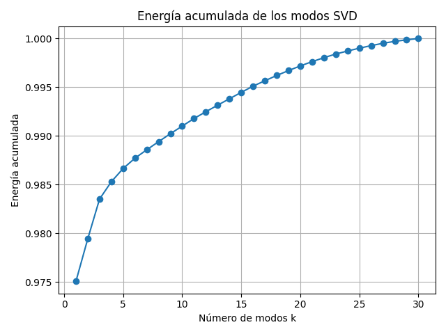
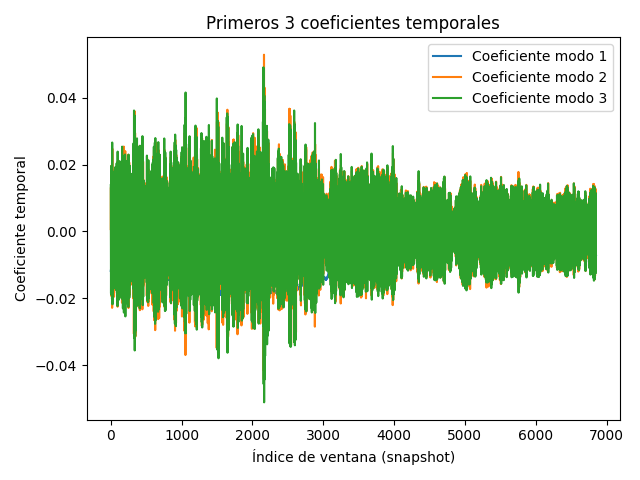
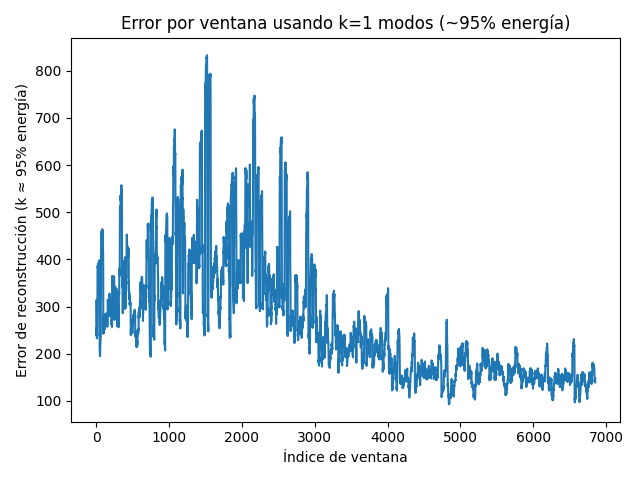
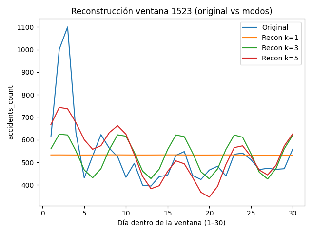
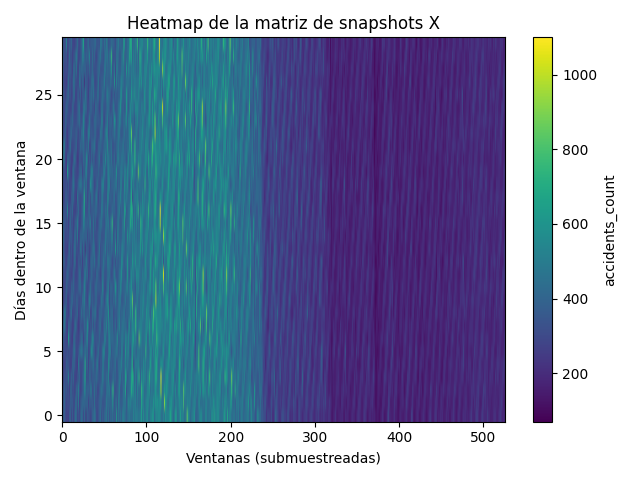

# Análisis SVD/POD Temporal con Ventanas Deslizantes de 30 Días
*(Serie diaria de accidentes – matriz de snapshots tipo “lagged windows”)*

## Table of Contents

1. [Introducción](#introduccion)
2. [Metodología aplicada](#metodologia-aplicada)
   1. [Construcción de la matriz de snapshots](#construccion-de-la-matriz-de-snapshots)
   2. [SVD/POD sobre la matriz X](#svdpod-sobre-la-matriz-x)
3. [Resultados y análisis de figuras](#resultados-y-analisis-de-figuras)
   1. [Figura 1 – Espectro de valores singulares (SVD)](#figura-1-espectro-de-valores-singulares-svd)
   2. [Figura 2 – Energía acumulada de los modos SVD](#figura-2-energia-acumulada-de-los-modos-svd)
   3. [Figura 3 – Primeros modos “espaciales” (patrones intra-ventana)](#figura-3-primeros-modos-espaciales-patrones-intra-ventana)
   4. [Figura 4 – Primeros coeficientes temporales](#figura-4-primeros-coeficientes-temporales)
   5. [Figura 5 – Error global de reconstrucción vs número de modos](#figura-5-error-global-de-reconstruccion-vs-numero-de-modos)
   6. [Figura 6 – Error por ventana usando k≈95% de energía](#figura-6-error-por-ventana-usando-k95-de-energia)
   7. [Figura 7 – Reconstrucción de una ventana representativa](#figura-7-reconstruccion-de-una-ventana-representativa)
   8. [Figura 8 – Reconstrucción de la ventana más anómala](#figura-8-reconstruccion-de-la-ventana-mas-anomala)
   9. [Figura 9 – Heatmap de la matriz de snapshots X](#figura-9-heatmap-de-la-matriz-de-snapshots-x)
4. [Discusión](#discusion)
5. [Conclusiones](#conclusiones)
6. [Referencias técnicas](#referencias-tecnicas)

---

<a id="introduccion"></a>
## Introducción

Este informe presenta un análisis **temporal puro** basado en el script
**`svd_pod_analysis.py`**. Se utiliza un escenario simple pero muy potente:
cada snapshot es una **ventana de 30 días** de una serie diaria. Esto permite:

- Identificar patrones dominantes dentro de un mes móvil.
- Medir la **baja dimensionalidad efectiva** del sistema.
- Evaluar reconstrucción y calidad de aproximación.
- Detectar **ventanas anómalas** usando el error de bajo rango.

---

<a id="metodologia-aplicada"></a>
## Metodología aplicada

<a id="construccion-de-la-matriz-de-snapshots"></a>
### Construcción de la matriz de snapshots

El script conecta con la base y lee la tabla `accidents_daily`, convirtiendo y ordenando
la columna `date`. Luego extrae la serie diaria:

- `y = daily["accidents_count"].values`
- `window_size = 30`
- `n_windows = len_series - window_size + 1`

Después construye la matriz:

\[
X \in \mathbb{R}^{30 \times n_{windows}}
\]

con la regla:

\[
X[:, j] = y[j:j+30]
\]

Esto está implementado explícitamente en el bloque 0 del script. Esto conduce a una matriz aproximada de forma **(30, 6850)**.

---

<a id="svdpod-sobre-la-matriz-x"></a>
### SVD/POD sobre la matriz X

Una vez construida \(X\), el script aplica:

\[
X = U \Sigma V^T
\]

y calcula:

- Energía por modo: \(E_i = \sigma_i^2\)
- Energía acumulada: \(E_{acum}(k)\)

El cálculo se observa en el bloque 1 del script. 

---

<a id="resultados-y-analisis-de-figuras"></a>
## Resultados y análisis de figuras

<a id="figura-1-espectro-de-valores-singulares-svd"></a>
### Figura 1 – Espectro de valores singulares (SVD)


El espectro en escala logarítmica es la primera evidencia de **reducibilidad**.
Una caída rápida implica que pocos modos explican gran parte de la variabilidad
de las ventanas de 30 días.

En otras palabras la figura muestra qué tan rápido decaen los valores singulares.
La energía está tan concentrada que con k=1 modo ya se captura ≈95% de la energía.

Figura generada en el bloque 2. 

---

<a id="figura-2-energia-acumulada-de-los-modos-svd"></a>
### Figura 2 – Energía acumulada de los modos SVD



Este gráfico muestra cuánta energía total está capturada por los primeros \(k\) modos.
El script imprime una tabla de energías de los primeros modos y calcula automáticamente:

\[
k_{95} = \min\{k : E_{acum}(k) \ge 0.95\}
\]

El cálculo mostró que k95 = 1, es decir, un solo modo ya explica ~95% de la varianza de todas las ventanas de 30 días.

Esto está implementado en el bloque 3 y en el cálculo posterior de \(k_{95}\). 

---

<a id="figura-3-primeros-modos-espaciales-patrones-intra-ventana"></a>
### Figura 3 – Primeros modos “espaciales” (patrones intra-ventana)


En este análisis, los modos de \(U\) representan **patrones prototípicos dentro
de las ventanas de 30 días**.  
Ayudan a ver si existe un perfil mensual típico, con picos en días específicos o
formas recurrentes de crecimiento/caída.

Cada curva: patrón típico de cómo evoluciona un ciclo de 30 días.

El Modo 1 es “la forma promedio” de un mes típico.

Modo 2 y 3 capturan variaciones más sutiles respecto a ese patrón base.

Figura generada en el bloque 4. 

---

<a id="figura-4-primeros-coeficientes-temporales"></a>
### Figura 4 – Primeros coeficientes temporales



Las filas de \(V^T\) muestran cómo la contribución de cada patrón intra-ventana
varía a lo largo de las miles de ventanas (snapshots).
Eje x: índice de ventana (de 1 a 6850).

Cada curva indica cómo cambia en el tiempo la contribución de cada modo.

Esto permite detectar:

- Cambios de régimen.
- Estacionalidad de mayor escala.
- Períodos donde un modo se vuelve dominante o se atenúa.


Figura generada en el bloque 5. 

---

<a id="figura-5-error-global-de-reconstruccion-vs-numero-de-modos"></a>
### Figura 5 – Error global de reconstrucción vs número de modos


El script calcula el error de Frobenius:

\[
\|X - X_k\|_F
\]

para \(k = 1, 2, \ldots\).  
Por la propiedad óptima del SVD, el error debe **disminuir** al agregar modos.

Muestra cuánto mejora la reconstrucción de la matriz a medida que se agrega modos.

El error cae casi todo con los primeros modos → el sistema es altamente reducible.

Figura generada en el bloque 6. 

---

<a id="figura-6-error-por-ventana-usando-k95-de-energia"></a>
### Figura 6 – Error por ventana usando k≈95% de energía



Este gráfico aplica una idea clave del análisis POD:
usar pocos modos dominantes para reconstruir y medir el residuo.

1. Se elige \(k_{95}\).
2. Se reconstruye \(X_{k95}\).
3. Se calcula para cada ventana:

\[
e_j = \|x_j - \hat{x}_j\|_2
\]

Ventanas con \(e_j\) alto son candidatas a anomalías.

Eje x: ventana (1…6850).

Eje y: error de reconstrucción de esa ventana usando k = 1 modo (porque k95=1).

Picos de error señalan ventanas más “raras” o menos típicas, candidatos a anomalías / periodos especiales.

Figura generada y \(k_{95}\) calculado en el bloque 7. 

---

<a id="figura-7-reconstruccion-de-una-ventana-representativa"></a>
### Figura 7 – Reconstrucción de una ventana representativa


El script define una función que compara la ventana original con reconstrucciones
con \(k = 1, 3, 5\) (si existen) y la aplica a una ventana central.

**Generación del gráfico para la ventana central (ventana 3426)**:

Curva Original: serie real de esa ventana de 30 días.

Curvas Recon k=1, 3, 5: reconstrucciones usando 1, 3 y 5 modos.

**Qué mirar aquí:**

Qué tan bien el modo 1 captura la forma global.

Cómo mejoran detalles con 3 y 5 modos.

Si el ruido/variaciones pequeñas quedan afuera (lo que suele ser deseable).

Esto sirve como ejemplo “típico” de calidad de aproximación.
Bloque 9 del script. 

---

<a id="figura-8-reconstruccion-de-la-ventana-mas-anomala"></a>
### Figura 8 – Reconstrucción de la ventana más anómala



El script identifica la ventana con mayor error en la Figura 6, usando k que captura ~95% de energía (en este caso, k95 = 1):

\[
j^* = \arg\max_j e_j
\]

y grafica su reconstrucción comparativa.

Esto permite justificar visualmente por qué esa ventana se considera atípica.

La selección del índice anómalo depende de `np.argmax(window_errors)`. 

---

<a id="figura-9-heatmap-de-la-matriz-de-snapshots-x"></a>
### Figura 9 – Heatmap de la matriz de snapshots X



El heatmap da una vista global de la matriz de snapshots.
En analogía con la lectura del heatmap 

- **día dentro de la ventana**
- **índice de ventana**

El script submuestrea columnas para mantener una figura legible. 

Es un heatmap de la matriz de snapshots,donde:

cada columna es una ventana de 30 días de la serie diaria de accidents_count.

cada fila corresponde a la posición del día dentro de la ventana (día 1…30).

Como 6850 columnas son demasiadas para visualizar, el código hizo submuestreo:

Con  n_windows=6850:

6850/500=13

o sea, el gráfico muestra aprox. 6850/13 ≈ 527 columnas.
Por eso el eje x va hasta ~520.

En coincidencia con la serie temporal, hay un cambio fuerte de "régimen" a mitad del gráfico:
- Primer tramo (aprox. columnas 0–220): más verde/amarillo → accidentes más altos.

- Segundo tramo (después de ~220): mucho más morado → nivel general de accidentes más bajo.

El SVD mostró que:
- El primer modo explica ~97.5%.

Esto concuerda con este heatmap: cuando un solo patrón domina, lo visual típicamente muestra: 
- un fondo bastante uniforme.
- y cambios grandes solo cuando hay tendencias globales o cambios de régimen.

El heatmap visualiza ese "dominio del patrón base"

---

<a id="discusion"></a>
## Discusión

El documento de referencia destaca que los espectros de energía sirven para
confirmar baja dimensión efectiva y orientar la investigación hacia los patrones más relevantes.

En este caso temporal:

- Si el modo 1 y 2 ya concentran gran energía,
  existe un “perfil mensual típico” de accidentes.
- Si \(k_{95}\) es bajo, el sistema es **altamente reducible**:
  una representación de bajo rango describe adecuadamente la mayoría de las ventanas.
- El error por ventana actúa como un mecanismo objetivo de
  **detección de eventos raros**.

---

<a id="conclusiones"></a>
## Conclusiones

1. La matriz de snapshots de 30 días transforma la serie diaria en un conjunto
   de observaciones comparables para extracción de patrones.
2. El espectro SVD y la energía acumulada cuantifican reducibilidad
   y permiten elegir un \(k\) de trabajo.
3. El error global de reconstrucción decrece con \(k\), validando el uso de
   pocos modos para aproximación compacta.
4. El error por ventana con \(k_{95}\) es una estrategia directa, transparente
   y computacionalmente simple para detectar ventanas anómalas.

---

<a id="referencias-tecnicas"></a>
## Referencias técnicas
  
- Implementación del análisis temporal: `svd_pod_analysis.py`. 

**Base de datos:** `extracted/analysis_data.db` (tabla `accidents_daily`)

---

## Cómo ejecutar

```bash
python svd_pod_analysis.py
```

El script generará automáticamente:

- `fig1_svd_spectrum.png`
- `fig2_cumulative_energy.png`
- `fig3_spatial_modes.png`
- `fig4_temporal_coeffs.png`
- `fig5_reconstruction_error.png`
- `fig6_window_errors_95.png`
- `fig9_X_heatmap.png`
- `central_window_<n>.png`
- `anomalous_window_<n>.png`
