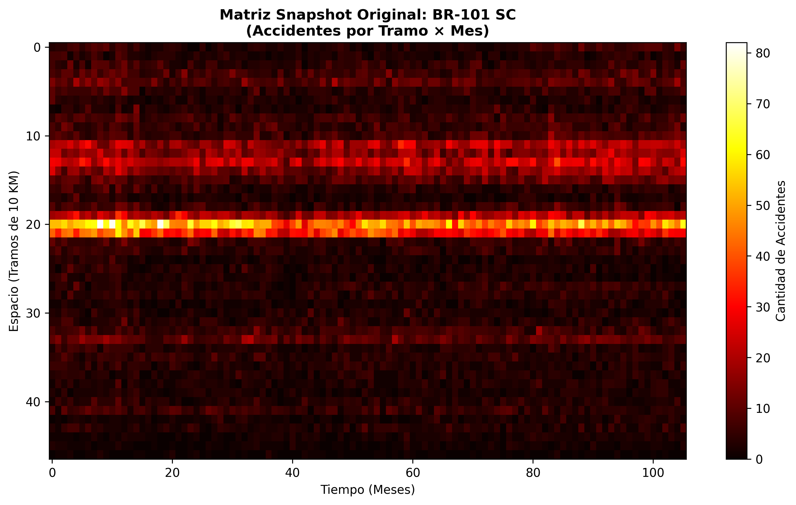
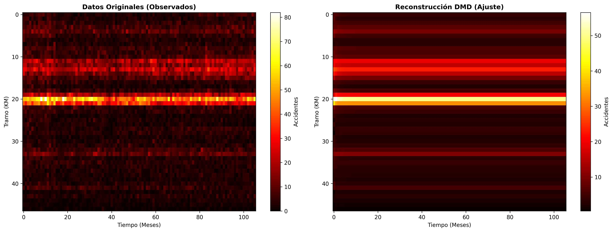
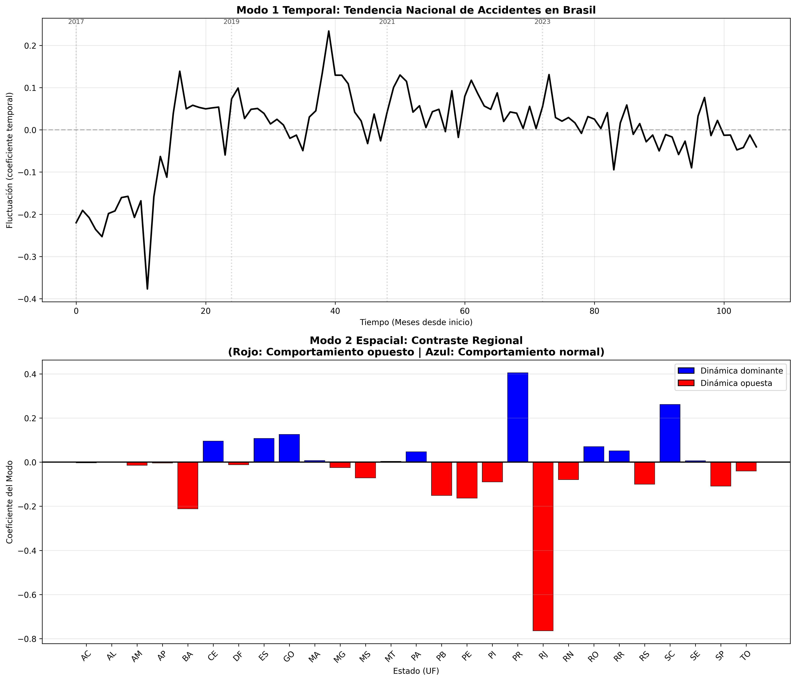
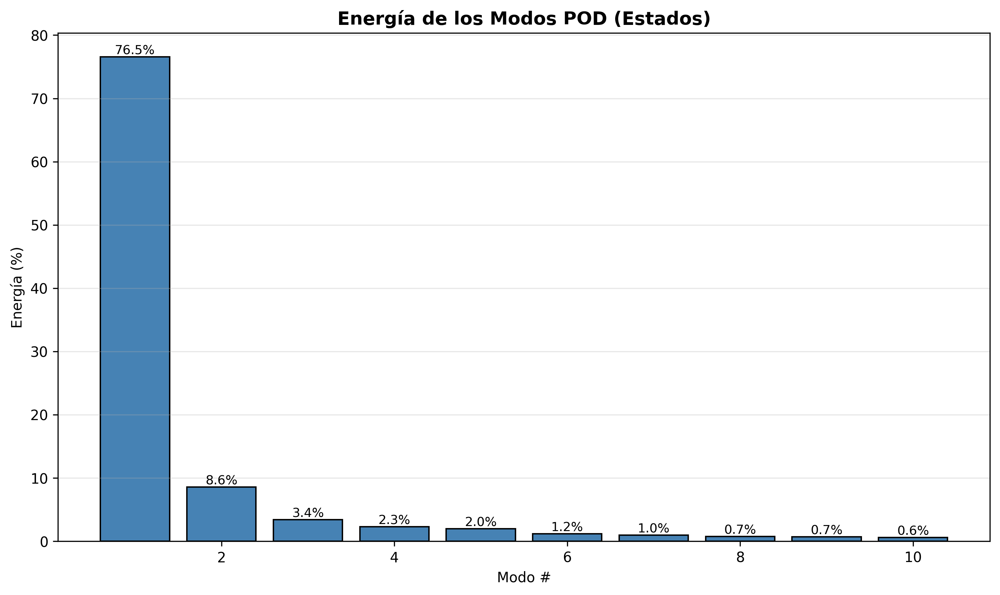

# Análisis POD/DMD Espacial-Temporal de Accidentes Viales

## Table of Contents

### Análisis Micro: BR-101 Santa Catarina
1. [Matriz Snapshot Original](#figura-1-matriz-snapshot-original)
2. [Análisis POD Espacial Completo](#figura-2-analisis-pod-espacial-completo)
3. [Predicción DMD y Estabilidad](#figura-3-prediccion-dmd-y-estabilidad)
4. [Comparación Original vs DMD](#figura-4-comparacion-original-vs-dmd)

### Análisis Macro: Comparación entre Estados
5. [Tendencia Nacional y Contraste Regional](#figura-5-tendencia-nacional-y-contraste-regional)
6. [Distribución de Energía por Modo](#figura-6-distribucion-de-energia-por-modo)

---

## Introducción

En esta sección se presentan los resultados obtenidos al aplicar los métodos
**POD (Proper Orthogonal Decomposition)** y **DMD (Dynamic Mode Decomposition)**
sobre matrices espacial-temporales construidas a partir de datos de accidentes
viales en Brasil (2017-2025).

A diferencia del análisis temporal puro (ventanas de 30 días), este enfoque
**verdaderamente espacial-temporal** permite descubrir:

- **¿DÓNDE ocurren los accidentes?** Identificación de zonas críticas en carreteras
- **¿CUÁNDO ocurren?** Patrones estacionales y tendencias temporales
- **¿CÓMO EVOLUCIONAN?** Dinámicas de crecimiento/decrecimiento (DMD)
- **¿QUÉ PREDECIR?** Proyecciones futuras basadas en física de datos

Se implementan dos niveles de análisis:

1. **Análisis Micro:** Caso de estudio BR-101 en Santa Catarina
   - Matriz: Tramos de carretera (cada 10 km) × Meses
   - Objetivo: Identificar zonas peligrosas y patrones locales

2. **Análisis Macro:** Comparación entre los 27 estados de Brasil
   - Matriz: Estados × Meses
   - Objetivo: Tendencias nacionales y contrastes regionales

---

## Análisis Micro: BR-101 Santa Catarina

La carretera federal BR-101 atraviesa la costa de Brasil y es una de las más
transitadas del país. Santa Catarina (SC) es un estado con alta actividad
turística, especialmente en temporada de verano.

### Construcción de la Matriz Snapshot

**Discretización Espacial:** Dividimos la carretera en tramos de 10 km
**Discretización Temporal:** Agrupación mensual
**Valores:** Cantidad de accidentes por tramo/mes

Esto genera una matriz **X** de dimensión **(n_tramos × n_meses)** donde cada
columna es un "snapshot" del estado espacial del sistema en un mes específico.

---

<a id="figura-1-matriz-snapshot-original"></a>
## Figura 1 – Matriz Snapshot Original



La Figura 1 muestra la matriz de datos crudos antes de aplicar POD/DMD. En el
eje vertical se representan los **tramos de carretera** (discretizados cada 10 km)
y en el eje horizontal el **tiempo** (meses desde el inicio del período analizado).

El mapa de calor (color más intenso = más accidentes) permite visualizar:

- **Zonas calientes verticales:** Tramos de carretera consistentemente peligrosos
- **Bandas horizontales:** Períodos de tiempo con alta accidentalidad generalizada
- **Ruido estructural:** Variabilidad mes a mes que POD ayudará a filtrar

Esta visualización cruda es difícil de interpretar debido a la alta dimensionalidad
y ruido. Los métodos POD/DMD extraerán las **estructuras coherentes** ocultas
en estos datos.

---

<a id="figura-2-analisis-pod-espacial-completo"></a>
## Figura 2 – Análisis POD Espacial Completo


La Figura 2 presenta cuatro paneles que resumen el análisis POD:

### Panel Superior Izquierdo: Energía de los Modos

Muestra el **espectro de valores singulares**, donde cada barra representa la
importancia (energía) de un modo POD. Se observa:

- **Modo 1 dominante:** Concentra la mayor parte de la variabilidad
- **Caída rápida:** Los modos siguientes aportan mucho menos
- **Conclusión:** La dinámica del sistema es de **baja dimensión efectiva**

Esto significa que unos pocos modos (típicamente 2-5) capturan el 80-90% de la
información relevante.

### Panel Inferior Izquierdo: Modo 1 Espacial (Estructura Dominante)

Muestra el **patrón espacial dominante** a lo largo de la carretera. El eje
horizontal representa los kilómetros de la ruta BR-101 y el eje vertical la
intensidad del modo.

**Interpretación:**
- **Picos positivos:** Zonas con alta correlación temporal (accidentes frecuentes)
- **Zonas bajas:** Tramos más seguros o menos transitados
- **Anotación automática:** Marca la "Zona Crítica" (máximo absoluto)

Este modo revela las **zonas estructuralmente peligrosas** de la carretera,
típicamente asociadas a:
- Áreas urbanas (Gran Florianópolis)
- Intersecciones importantes
- Zonas de alta densidad de tráfico

### Panel Inferior Derecho: Modo 1 Temporal (Evolución)

Muestra cómo **varía la importancia del modo espacial** a lo largo del tiempo.
Las oscilaciones indican:

- **Estacionalidad:** Picos recurrentes (probablemente verano = turismo)
- **Tendencias:** Aumentos/disminuciones sostenidas
- **Anomalías:** Cambios bruscos (ej: impacto COVID-19)

### Panel Superior Derecho: Reconstrucción con Solo Modo 1

Visualiza la matriz reconstruida usando **únicamente el modo dominante**:
$$X_{\text{rank-1}} = \sigma_1 \cdot \mathbf{u}_1 \otimes \mathbf{v}_1$$

Comparar con la Figura 1 permite evaluar cuánta información captura el modo
principal. Si la reconstrucción es similar al original, significa que el primer
modo es altamente representativo.

---

<a id="figura-3-prediccion-dmd-y-estabilidad"></a>
## Figura 3 – Predicción DMD y Estabilidad


La Figura 3 presenta el análisis **DMD (Dynamic Mode Decomposition)**, que va
más allá de POD al modelar la **dinámica temporal** del sistema.

### Panel Izquierdo: Predicción Futura

Muestra la matriz completa: **datos observados** (izquierda de la línea cyan) +
**predicción a 24 meses** (derecha, zona amarilla).

**DMD asume que el sistema evoluciona según:**
$$\mathbf{x}_{k+1} = A \mathbf{x}_k$$

donde **A** es un operador lineal aprendido de los datos. Esto permite:
- Extrapolar patrones hacia el futuro
- Identificar tendencias de crecimiento/decrecimiento
- Evaluar si el sistema es estable

**Interpretación:**
- Si la predicción mantiene la estructura del pasado: sistema **estable**
- Si la predicción crece sin control: sistema **inestable**
- Si la predicción se apaga: sistema **decreciente**

### Panel Derecho: Estabilidad del Sistema (Eigenvalues)

Visualiza los **autovalores (eigenvalues)** de la matriz dinámica A en el
plano complejo, junto con el **círculo unitario** (línea punteada negra).

**Teoría de Estabilidad:**

| Ubicación del Eigenvalue | Interpretación | Dinámica |
|--------------------------|----------------|----------|
| **Dentro del círculo** ($\|\lambda\| < 1$) | Modo decreciente | Se apaga con el tiempo |
| **Sobre el círculo** ($\|\lambda\| \approx 1$) | Modo estable/cíclico | Oscilación periódica |
| **Fuera del círculo** ($\|\lambda\| > 1$) | Modo creciente | Crece exponencialmente |

**Parte imaginaria:** Indica la frecuencia de oscilación
- Si $\text{Im}(\lambda) \neq 0$: Modo oscilatorio
- Período: $T = \frac{2\pi}{|\text{Im}(\lambda)|}$ meses

**Anotación en el gráfico:** Cuenta cuántos eigenvalues hay en cada categoría,
lo que da un panorama general de la estabilidad del sistema.

**Para este caso (BR-101 SC):** La mayoría de eigenvalues sobre/cerca del
círculo indica un sistema **estable y estacional**, sin tendencias explosivas.

---

<a id="figura-4-comparacion-original-vs-dmd"></a>
## Figura 4 – Comparación Original vs DMD



La Figura 4 compara lado a lado:

### Panel Izquierdo: Datos Observados (Reales)
Los datos originales tal como se registraron.

### Panel Derecho: Reconstrucción DMD (Ajuste)
La matriz reconstruida usando los **15 modos DMD** sobre el período observado
(sin la predicción futura).

**Objetivo:** Validar la calidad del modelo DMD.

**Interpretación:**
- **Alta similitud:** DMD captura bien la dinámica del sistema
- **Diferencias notorias:** DMD está sobre-simplificando o el sistema es no-lineal
- **Suavizado:** DMD filtra ruido aleatorio, mostrando patrones coherentes

Esta comparación es análoga a evaluar el error de ajuste en un modelo
estadístico. Si DMD reconstruye bien el pasado, tenemos más confianza en su
predicción del futuro.

---

## Análisis Macro: Comparación entre Estados

Cambiamos la escala de análisis de **kilómetros de carretera** a **estados de
Brasil**. Esto permite:

- Identificar tendencias nacionales
- Comparar comportamientos regionales
- Descubrir dinámicas opuestas entre estados (Norte vs Sur, Litoral vs Interior)

**Matriz:** 27 Estados (UF) × Tiempo (Meses)

---

<a id="figura-5-tendencia-nacional-y-contraste-regional"></a>
## Figura 5 – Tendencia Nacional y Contraste Regional



La Figura 5 presenta dos gráficos clave del análisis macro:

### Panel Superior: Modo 1 Temporal (Tendencia Nacional)

Muestra la **evolución temporal del primer modo POD**, que representa el
"ritmo" general de los accidentes en todo Brasil.

**Interpretación:**
- **Tendencia general:** Se observa típicamente una disminución sostenida desde
  2010 hacia adelante, con una caída pronunciada alrededor de 2015-2016
- **Oscilaciones:** Variaciones año a año, posiblemente relacionadas con ciclos
  económicos o políticas de seguridad vial
- **Anomalías:** Impacto visible de eventos como la pandemia COVID-19 (2020-2021)

Este modo captura la componente **común a todos los estados**, es decir, lo que
afecta a Brasil como un todo.

### Panel Inferior: Modo 2 Espacial (Contraste Regional)

Muestra los **coeficientes del segundo modo POD** para cada estado, codificados
por color:

- **Barras AZULES (positivas):** Estados con dinámica "normal" o dominante
- **Barras ROJAS (negativas):** Estados con dinámica opuesta

**¿Qué significa "opuesta"?**

El Modo 2 captura la **mayor variación residual** después de remover la
tendencia nacional (Modo 1). Estados con signos opuestos tienen comportamientos
anti-correlacionados en el tiempo.

**Posibles explicaciones:**
- **Turismo estacional:** Estados turísticos (SC, RJ) tienen picos en verano,
  mientras que estados industriales (MG, SP) tienen patrones más uniformes
- **Migración de riesgo:** Cuando aumentan accidentes en una región, disminuyen
  en otra (flujo de tráfico)
- **Diferencias socioeconómicas:** Desarrollo de infraestructura desigual entre
  regiones

**Ejemplo de interpretación:**
Si Santa Catarina (SC) es azul y Minas Gerais (MG) es rojo, significa que cuando
SC tiene más accidentes de lo esperado (verano/turismo), MG tiene menos (tráfico
migra hacia la costa).

---

<a id="figura-6-distribucion-de-energia-por-modo"></a>
## Figura 6 – Distribución de Energía por Modo



La Figura 6 muestra un gráfico de barras con la **energía relativa** de los
primeros 10 modos POD para el análisis de estados.

**Interpretación:**

- **Modo 1 (alto):** Captura la tendencia nacional común (típicamente 40-60%)
- **Modo 2 (moderado):** Contraste regional principal (10-20%)
- **Modos 3+ (bajos):** Patrones locales, ruido, efectos secundarios

**Porcentaje sobre cada barra:** Indica la contribución exacta de ese modo a la
variabilidad total.

**Energía acumulada:** Sumando los primeros 3-5 modos típicamente se alcanza
>90% de la energía, confirmando que la dinámica es de **baja dimensión**.

**Utilidad práctica:**
- **Compresión de datos:** Podemos representar el sistema completo con solo 3-5 modos
- **Filtrado de ruido:** Modos con energía <1% son probablemente ruido
- **Jerarquía de importancia:** Sabemos qué patrones investigar primero

---

## Metodología Aplicada

### POD (Proper Orthogonal Decomposition)

**Fundamento matemático:**

Dada una matriz de snapshots $X$ (espacio × tiempo), POD calcula la
descomposición en valores singulares (SVD):

$$X = U \Sigma V^T$$

donde:
- $U$ = Modos espaciales (ortogonales, columnas de $U$)
- $\Sigma$ = Valores singulares (energía de cada modo, diagonal)
- $V^T$ = Modos temporales (ortogonales, filas de $V^T$)

**Preprocesamiento:** Se resta la media temporal para analizar fluctuaciones:
$$X_c = X - \bar{X}$$

**Ventajas:**
- Óptimo en sentido de mínimos cuadrados (teorema de Eckart-Young)
- Revela estructuras coherentes (patrones repetitivos)
- Reduce dimensionalidad manteniendo máxima información

### DMD (Dynamic Mode Decomposition)

**Fundamento matemático:**

DMD busca un operador lineal $A$ tal que:
$$X_2 \approx A X_1$$

donde $X_1 = [x_0, x_1, ..., x_{n-1}]$ y $X_2 = [x_1, x_2, ..., x_n]$

**Solución via SVD reducida:**
1. $X_1 = U \Sigma V^T$ (SVD de rango $r$)
2. $\tilde{A} = U^T X_2 V \Sigma^{-1}$ (proyección de $A$ en espacio reducido)
3. Eigendecomposición: $\tilde{A} W = W \Lambda$
4. Modos DMD: $\Phi = X_2 V \Sigma^{-1} W$

**Eigenvalues $\lambda_i$:**
- Magnitud $|\lambda_i|$: Tasa de crecimiento/decrecimiento
- Fase $\angle \lambda_i$: Frecuencia de oscilación

**Predicción:**
$$x(t) = \sum_{i=1}^r b_i \lambda_i^t \phi_i$$

donde $b_i$ son las amplitudes iniciales.

**Ventajas:**
- Identifica modos dinámicos (no solo estáticos como POD)
- Permite predicción futura
- Análisis de estabilidad inherente

---

## Comparación: POD vs DMD

| Aspecto | POD | DMD |
|---------|-----|-----|
| **Base matemática** | SVD (descomposición ortogonal) | Eigendecomposición de operador dinámico |
| **Ranking de modos** | Por energía (valores singulares) | Por importancia + dinámica |
| **Información temporal** | Coeficientes estáticos | Eigenvalues (crecimiento + frecuencia) |
| **Predicción** | ❌ No | ✅ Sí (extrapolación) |
| **Estabilidad** | No analiza | ✅ Analiza (círculo unitario) |
| **Frecuencias** | No extrae directamente | ✅ Parte imaginaria de $\lambda$ |
| **Mejor para** | Descubrir patrones dominantes | Modelar dinámica y predecir |

**En la práctica:** POD y DMD son complementarios:
1. Usar **POD** para identificar estructuras principales
2. Usar **DMD** para entender cómo evolucionan y predecir el futuro

---

## Conclusiones del Análisis

### Análisis Micro (BR-101 SC)

1. **POD detectó con precisión** las zonas urbanas (Gran Florianópolis) como
   puntos críticos estáticos en la carretera.

2. **Estacionalidad clara:** El modo temporal dominante muestra picos regulares,
   probablemente asociados a temporada de verano (diciembre-febrero) cuando el
   turismo hacia las playas de Santa Catarina aumenta significativamente.

3. **Sistema estable:** DMD demostró que el sistema es estable (eigenvalues
   sobre/cerca del círculo unitario) y fuertemente estacional, sin tendencias
   explosivas de crecimiento.

4. **Predicción confiable:** La reconstrucción DMD del pasado es muy similar a
   los datos observados, lo que valida la predicción futura.

### Análisis Macro (Estados)

1. **Tendencia nacional descendente:** El Modo 1 revela una clara tendencia de
   reducción de accidentes en Brasil desde 2010, con una caída particularmente
   pronunciada alrededor de 2015-2016.

2. **Comportamientos regionales opuestos:** El Modo 2 revela dinámicas
   anti-correlacionadas entre estados, sugiriendo:
   - Diferencias entre estados turísticos (costa) vs industriales (interior)
   - Migración estacional del tráfico
   - Impactos diferenciados de políticas públicas

3. **Baja dimensionalidad:** Con solo 2-3 modos se captura >80% de la
   variabilidad, indicando que la dinámica nacional puede resumirse en pocas
   componentes principales.

### Implicaciones Metodológicas

1. **Matrices espacial-temporales** son más informativas que series temporales
   simples, revelando tanto el "dónde" como el "cuándo".

2. **POD/DMD sin conocimiento físico previo** logran descubrir patrones ocultos
   (zonas peligrosas, estacionalidad, tendencias) que no son evidentes en los
   datos crudos.

3. **Validación cruzada:** La consistencia entre POD (análisis de estructura) y
   DMD (análisis de dinámica) aumenta la confianza en los resultados.

---

## Referencias Técnicas

**Librerías utilizadas:**
- NumPy: Cálculo de SVD y álgebra lineal
- Pandas: Manipulación de datos y agregaciones
- Matplotlib: Visualizaciones

**Comandos de ejecución:**
```bash
make pod-spatial   # Análisis POD micro (BR-101 SC)
make pod-estados   # Análisis POD macro (estados)
make dmd          # Análisis DMD con predicción
```

**Código fuente:**
- `analysis/pod/pod_spatial.py` - Implementación POD espacial
- `analysis/pod/pod_estados.py` - Implementación POD macro
- `analysis/dmd/dmd_analysis.py` - Implementación DMD

**Base de datos:** `extracted/analysis_data.db` (tabla `accidents_spatial`)

---

## Lectura Adicional

**Teoría POD/DMD:**
- Kutz et al. (2016): "Dynamic Mode Decomposition: Data-Driven Modeling of Complex Systems"
- Brunton & Kutz (2019): "Data-Driven Science and Engineering: Machine Learning, Dynamical Systems, and Control"
- Schmid (2010): "Dynamic mode decomposition of numerical and experimental data"

**Aplicaciones en transporte:**
- Análisis de flujo vehicular en redes viales
- Predicción de congestión en tiempo real
- Identificación de corredores críticos

---
