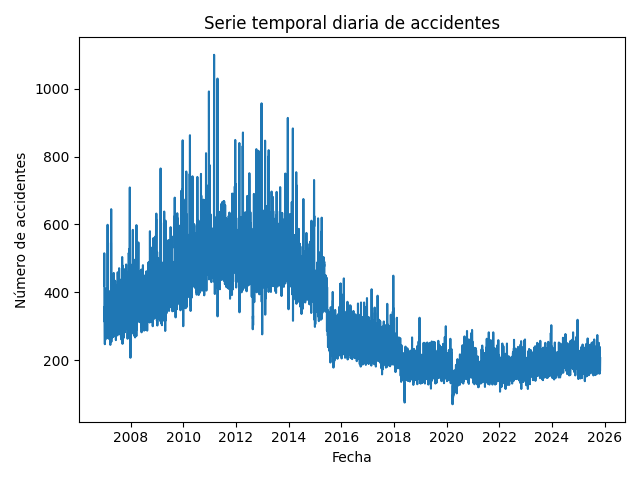
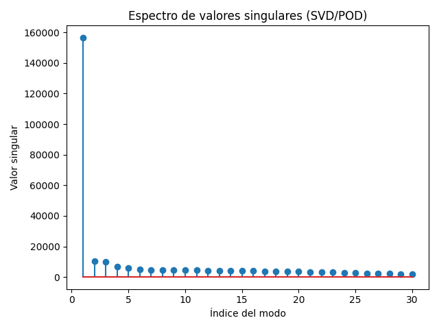
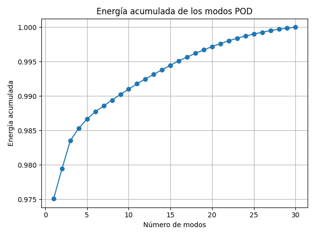
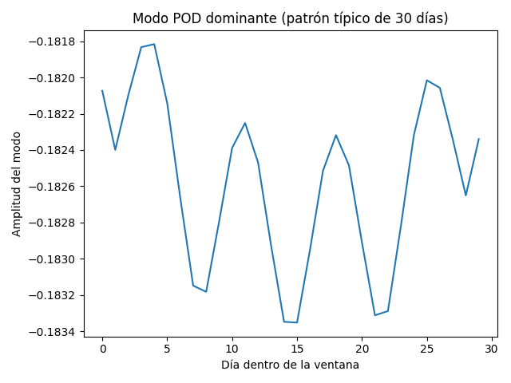
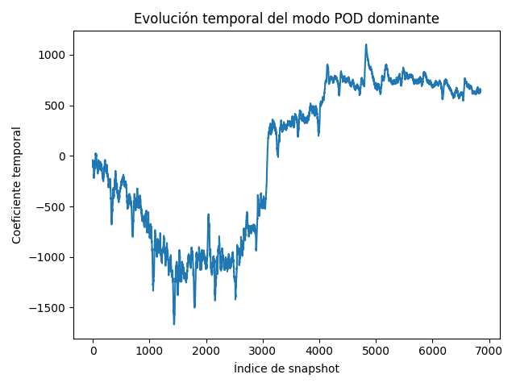

# Análisis SVD/POD de la serie diaria de accidentes

## Table of Contents

1. [Serie temporal diaria de accidentes](#figura-1-serie-temporal-diaria-de-accidentes)
2. [Espectro de valores singulares (SVD/POD)](#figura-2-espectro-de-valores-singulares)
3. [Energía acumulada de los modos POD](#figura-3-energia-acumulada-de-los-modos-pod)
4. [Modo POD dominante (patrón típico de 30 días)](#figura-4-modo-pod-dominante)
5. [Evolución temporal del modo POD dominante](#figura-5-evolucion-temporal-del-modo-pod-dominante)

En esta sección se presentan los resultados obtenidos al aplicar los métodos
SVD/POD sobre la matriz de snapshots construida a partir de la serie diaria de
accidentes (ventanas de 30 días).

---

## Figura 1 – Serie temporal diaria de accidentes

La Figura 1 muestra la serie temporal diaria de accidentes durante todo el
periodo disponible en la base de datos. En el eje horizontal se representa la
fecha y en el eje vertical el número de accidentes registrados cada día.

Se observa una **primera etapa** con niveles relativamente altos y muy
variables, donde los accidentes diarios presentan oscilaciones importantes y
picos que superan los 800–1000 casos. Posteriormente, alrededor de los años
2015–2016, se aprecia una **reducción brusca del nivel medio** de accidentes,
tras la cual la serie entra en una **nueva etapa más estable**, con valores
diarios generalmente más bajos y menos dispersos. Esta figura proporciona el
contexto global sobre el que se aplican las técnicas de descomposición
(SVD/POD/DMD), que buscan extraer patrones dominantes y estructuras ocultas a
partir de esta señal aparentemente ruidosa.

---

## Figura 2 – Espectro de valores singulares (SVD/POD)

La Figura 2 muestra el espectro de valores singulares de la matriz de
snapshots. En el eje horizontal se representa el índice del modo y en el eje
vertical el valor singular correspondiente.

Se observa un **primer valor singular muy dominante**, seguido de una caída
brusca en los valores restantes. Esto indica que el **primer modo concentra la
mayor parte de la variabilidad** de los datos, mientras que los modos
siguientes aportan correcciones mucho menores.

---

## Figura 3 – Energía acumulada de los modos POD

La Figura 3 representa la **energía acumulada** en función del número de modos
incluidos. La energía se calcula a partir de los cuadrados de los valores
singulares y se normaliza para que el total sea 1.

Se aprecia que con **muy pocos modos** (del orden de 1–3) ya se captura un
porcentaje de energía cercano al 97–98 %, y que, al aumentar el número de
modos, la energía acumulada se aproxima rápidamente al 100 %. Esto confirma
que la dinámica efectiva del sistema es de **baja dimensión**, es decir, puede
describirse adecuadamente mediante un conjunto reducido de modos POD.

---

## Figura 4 – Modo POD dominante (patrón típico de 30 días)

La Figura 4 muestra el **primer modo POD**, o modo dominante, como función del
día dentro de la ventana de 30 días. En el eje horizontal se indica la posición
(día 1 a día 30) y en el eje vertical la amplitud del modo.

El modo dominante presenta una forma **casi constante** a lo largo de los 30
días, con oscilaciones relativamente pequeñas alrededor de un valor medio.
Esto sugiere que, dentro de cada ventana mensual, el **patrón principal de
accidentes es aproximadamente uniforme**, sin un máximo o mínimo muy marcado
en días específicos. Es decir, lo que domina es el **nivel medio de accidentes
en el periodo**, más que una estructura intramensual compleja.

---

## Figura 5 – Evolución temporal del modo POD dominante

La Figura 5 presenta la evolución temporal del **coeficiente del primer modo
POD** a lo largo de todos los snapshots. El eje horizontal representa el índice
del snapshot (ventanas sucesivas en el tiempo) y el eje vertical el valor del
coeficiente asociado al modo dominante.

Cuando este coeficiente toma valores **más negativos**, el patrón dominante se
asocia a niveles de accidentes relativamente más bajos respecto a la media.
Cuando el coeficiente pasa a valores **positivos y elevados**, el mismo patrón
se asocia a niveles relativamente más altos.

De este modo, la gráfica permite identificar **periodos en los que el nivel
típico de accidentes disminuye o aumenta** a lo largo de los años, reflejando
tendencias de fondo que no son tan evidentes al observar únicamente la serie
original día a día.

---
